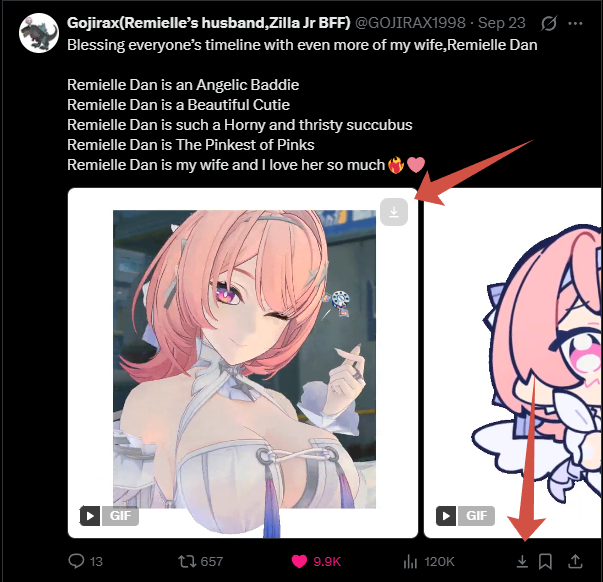
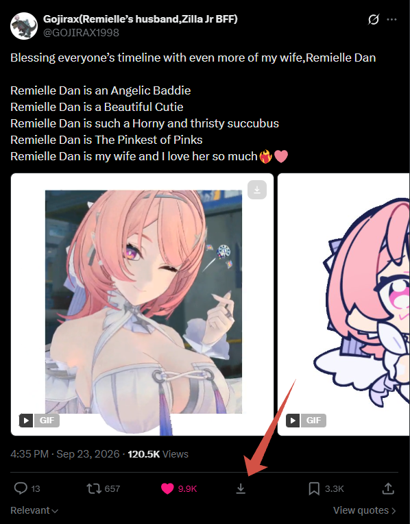
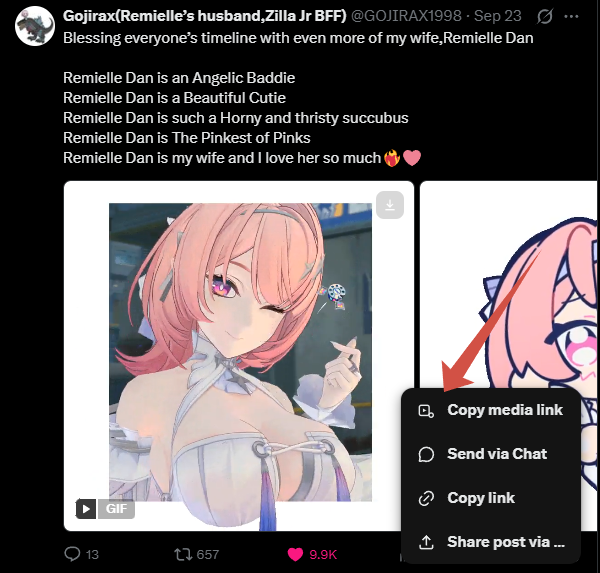
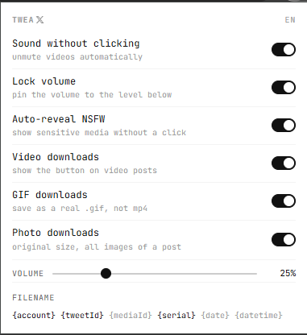

# TWEAX

**A browser extension that makes media on X (Twitter) work the way it should.**

Download videos with one click — sound included — save GIFs as real `.gif` files, grab photos at their original size, and never fight the mute button again. Everything runs locally in your browser: no servers, no accounts, no tracking.

Works in Chrome and Edge (Manifest V3, Chromium 116+).

## What it looks like

<table>
  <tr>
    <td width="50%" align="center">
      
      <br><sub><b>Download buttons in the feed</b> — on every GIF/video and in the action bar</sub>
    </td>
    <td width="50%" align="center">
      
      <br><sub><b>An open post</b> — the button sits between Retweet and Bookmark</sub>
    </td>
  </tr>
  <tr>
    <td width="50%" align="center">
      
      <br><sub><b>Copy media link</b> — its own item in X's native Share menu</sub>
    </td>
    <td width="50%" align="center">
      
      <br><sub><b>The popup</b> — one toggle per feature, five languages</sub>
    </td>
  </tr>
</table>

---

## Features

### 📥 Download videos right on X
Posts with video get a native-looking **Download** button in the action bar (next to Bookmark and Share), in both the feed and an open post. One click and the video lands in your Downloads folder — **with sound**, in a single `.mp4`.

X serves video and audio as two separate streams. TWEAX fetches both, stitches the segments together, and muxes them into one file using **ffmpeg.wasm** running locally in your browser. You get the best quality X offers for that post.

### 🎞️ Real GIFs
X stores GIFs as silent looping `.mp4` videos. TWEAX converts them back into actual animated `.gif` files, so they work anywhere — messengers, forums, image embeds.

### 🖼️ Photos at original size
A post with photos gets a download action too: every image is saved at its **original resolution**, one file per photo (or one `.zip` if there are several).

### 🔗 Copy media link
X's Share menu gains a **Copy media link** item. It puts the direct URL on your clipboard: the `.mp4` for videos and GIFs, original URLs for photos. Handy for sharing or passing to another tool.

### 🔊 Sound without clicking
X autoplays videos muted and there's no setting to change that. TWEAX unmutes videos automatically, so scrolling the feed sounds like scrolling the feed — not like a slot machine. No clicks needed.

### 🔒 Lock volume
Pins the playback volume to a level you choose in the popup. You can still drag the player's own slider for the current video — the next one simply starts at your pinned level again.

### 👁️ Auto-reveal NSFW
X hides sensitive media behind a blurred "Show" overlay. TWEAX reveals it automatically, so the feed scrolls without interruptions — and revealed videos immediately benefit from the sound tweaks.

---

## Installation

**Step 1 — get the extension:**

- **Ready-made archive (easiest):** grab `TWEAX-<version>.zip` or `.7z` from the [latest release](https://github.com/VolcharaVasiliy/TWEAX/releases/latest) and unpack it.
- **From source:** clone this repository, or use Code → Download ZIP.

**Step 2 — load it into the browser:**

1. Open `chrome://extensions` (Chrome) or `edge://extensions` (Edge).
2. Enable **Developer mode** (toggle in the corner).
3. Click **Load unpacked** and select the `TWEAX` folder (the one containing `manifest.json`).
4. Pin TWEAX to the toolbar and open [x.com](https://x.com).

After updating the files, hit the ↻ **Reload** button on the extension card.

---

## Usage

Open the TWEAX popup to toggle what it does:

| Toggle | What it controls |
| --- | --- |
| **Sound without clicking** | Auto-unmute videos on X |
| **Lock volume** | Pin volume to the slider level below |
| **Auto-reveal NSFW** | Show sensitive media without the click |
| **Video downloads** | Show the Download button on video posts |
| **GIF downloads** | Save GIFs as real `.gif` files |
| **Photo downloads** | Enable photo downloading |
| **Filename pattern** | Template for downloaded file names |

The popup and the button labels speak English, Russian, Chinese, Japanese, and Spanish — click the language code (EN/RU/ZH/JA/ES) in the popup's corner to switch.

### Filename template

The popup lists the available parts as tags — click a tag to include it (black) or skip it (gray). Enabled parts join with `_`, and the default set is `{account}_{tweetId}_{serial}` → `nasa_1234567890_1.jpg`. Available parts:

| Part | Becomes |
| --- | --- |
| `{account}` | The author's handle, without the `@` |
| `{tweetId}` | The tweet's id |
| `{mediaId}` | The media file's id on X's CDN |
| `{serial}` | 1-based position of the media within the post |
| `{date}` | The tweet's date — `YYYYMMDD` |
| `{datetime}` | The tweet's date and time — `YYYYMMDD_HHMMSS` |

Characters a filesystem won't accept are replaced with `_`.

---

## Privacy

- **Nothing is sent to any server.** There is no backend, no analytics, no telemetry, no account — the extension has nothing to phone home to.
- The only network requests TWEAX makes are the ones your browser already makes: fetching the video/audio segments and images from X's own CDN, plus copying a URL to the clipboard.
- Your settings live in your browser's local storage and never leave it.

---

## Permissions

| Permission | Why it's needed |
| --- | --- |
| `storage` | Remember your toggles and language |
| `downloads` | Save finished files to your Downloads folder |
| `tabs` / `activeTab` / `scripting` | Find media on the page you're viewing and report download progress back to its button |
| `webRequest` | Observe which media files the page has loaded (read-only; nothing is modified or blocked) |
| `offscreen` | Run the ffmpeg.wasm muxing pipeline in a hidden page (service workers can't do it) |
| Host access (`<all_urls>`) | Media can be hosted on several CDN domains; the sound tweaks need to attach to the player page |

---

## How it works (for the curious)

```
content/x-button.js      Injects the Download button + "Copy media link" into x.com,
                         identifies the tweet's video, shows progress on the button
content/tweaks-main.js   MAIN-world shim: intercepts muted/volume on HTMLMediaElement
                         so the page can't force-mute videos back
content/tweaks-bridge.js Isolated-world bridge: settings → page, media URLs → background
background/index.js      Service worker: job queue, dedupe, offscreen lifecycle, chrome.downloads
background/media-index.js  Per-tab ledger of media the page has fetched
offscreen/offscreen.js   The download pipeline: HLS assembly (AES-128 decryption included),
                         video+audio muxing, GIF conversion, .zip packing
ffmpeg/                  Bundled @ffmpeg/ffmpeg + @ffmpeg/core (WebAssembly)
```

The download pipeline lives in an offscreen document because an MV3 service worker can't run WebAssembly workers or create blob URLs. HLS playlists are assembled with bounded-concurrency segment fetching, retries, and AES-128 decryption via WebCrypto; X's split `avc1`/`mp4a` streams are muxed with stream-copy ffmpeg.wasm (no re-encode, no quality loss).

---

## Limitations

- **X only** for the in-page features — the Download button, the Share-menu item, and the sound tweaks are built around x.com's player and DOM.
- **DASH (`.mpd`) playlists are not supported** — only HLS and direct files.
- DRM-protected content cannot and will not be downloaded.
- Very long videos take a while: segments are fetched, joined, and muxed locally.

---

## Credits

- [ffmpeg.wasm](https://github.com/ffmpegwasm/ffmpeg.wasm) — FFmpeg compiled to WebAssembly (bundled in `ffmpeg/`).
- [JetBrains Mono](https://www.jetbrains.com/lp/mono/) — the popup's typeface.

## License

Released under the [MIT License](LICENSE).
